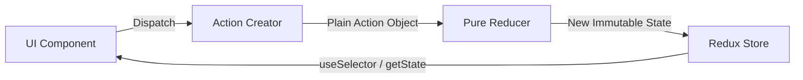

# Practical 5: Full CRUD Architecture & Redux State

> **Module**: Practical 5  
> **Route Path**: `/practical-5`  
> **Source Directory**: `src/app/practical-5/` & `src/components/modules/practical-5/`  
> **Test File**: `__tests__/practical-5.test.tsx`  
> **Key Technologies**: Redux, Axios REST Service Layer, JSONPlaceholder API, Full CRUD Operations, Splash Transition

---

## 1. Overview & Objectives

Practical 5 implements a full-lifecycle **CRUD (Create, Read, Update, Delete)** application connected to the public JSONPlaceholder Users API, coupled with a dedicated Redux state management architecture and an interactive Redux Counter demo.

### Core Features:
1. **Branded Splash Screen**: Animated introductory loading screen with automatic timeout transition to the main user directory.
2. **Read (User Directory)**: Scrollable list of users featuring complete contact details (Name, Username, Email, Phone, Website, Company, Address).
3. **Read (Single User View)**: Detailed user profile card displaying extended metadata and direct edit/delete triggers.
4. **Create (Add User)**: Form allowing user registration with full validation, Axios `POST` dispatch, and instant UI list synchronization.
5. **Update (Edit User)**: Form pre-filled via route parameters, allowing modifications with Axios `PUT` dispatch and local state replacement.
6. **Delete (Remove User)**: Interactive removal workflow protected by a confirmation dialog and Axios `DELETE` dispatch.
7. **Redux Counter Demo**: Interactive playground demonstrating pure Redux unidirectional data flow (Increment, Decrement, Reset) without slice abstractions.
8. **Automated Unit Testing**: Complete test suite in [__tests__/practical-5.test.tsx](file:///Users/darshan/Documents/Projects/ReactNative/MyStructure/MyExpoStructure/__tests__/practical-5.test.tsx).

---

## 2. Directory & File Structure

```text
src/
├── app/
│   └── practical-5/
│       ├── _layout.tsx                  # Stack layout for Practical 5 routes
│       ├── index.tsx                    # Splash entry point route (thin re-export)
│       ├── splash.tsx                   # Splash screen route (thin re-export)
│       ├── single-user.tsx              # Single user profile route (thin re-export)
│       ├── add-user.tsx                 # Add user route (thin re-export)
│       ├── update-user.tsx              # Edit/Update user route (thin re-export)
│       └── counter.tsx                  # Redux Counter demo route (thin re-export)
├── components/
│   └── modules/
│       └── practical-5/
│           ├── index.ts                     # Public export barrel
│           ├── config/
│           │   └── baseUrl.ts               # JSONPlaceholder base URL definition
│           ├── constants/
│           │   ├── colors.ts                # Color constants
│           │   └── fontFamily.ts            # Font constants
│           ├── utils/
│           │   └── dimension.ts             # Screen dimension scaling helper
│           ├── services/
│           │   └── api.ts                   # Centralized Axios CRUD service layer
│           ├── redux/
│           │   ├── store.ts                 # Redux Store creation
│           │   ├── actionTypes.ts           # Redux Action Type string constants
│           │   ├── actions.ts               # Redux Action Creators
│           │   └── reducers.ts              # Redux Root Reducer (Counter & Users)
│           ├── components/
│           │   ├── Header/                  # Top bar with Back and Action icons
│           │   ├── Spinner/                 # Modal activity indicator overlay
│           │   ├── TextInputComp/           # Form text input component
│           │   ├── UsersList/               # User directory item card
│           │   └── index.ts                 # Components barrel
│           └── screens/
│               ├── splash/                  # Branded splash screen
│               ├── listOfUsers/             # User directory screen (Read/List)
│               ├── singleUser/              # User profile card (Read/Detail)
│               ├── addUser/                 # Create user screen
│               ├── updateUser/              # Update user screen
│               └── counter/                 # Redux Counter demo screen
└── __tests__/
    └── practical-5.test.tsx             # Jest unit tests for CRUD & Redux
```

---

## 3. Redux State Architecture

The application uses classical Redux principles with predictable unidirectional data flow:



### 1. Action Types ([src/components/modules/practical-5/redux/actionTypes.ts](file:///Users/darshan/Documents/Projects/ReactNative/MyStructure/MyExpoStructure/src/components/modules/practical-5/redux/actionTypes.ts))
```typescript
export const INCREMENT = 'INCREMENT'
export const DECREMENT = 'DECREMENT'
export const RESET = 'RESET'
```

### 2. Action Creators ([src/components/modules/practical-5/redux/actions.ts](file:///Users/darshan/Documents/Projects/ReactNative/MyStructure/MyExpoStructure/src/components/modules/practical-5/redux/actions.ts))
```typescript
import { INCREMENT, DECREMENT, RESET } from './actionTypes'

export const increment = () => ({ type: INCREMENT })
export const decrement = () => ({ type: DECREMENT })
export const reset = () => ({ type: RESET })
```

### 3. Reducer ([src/components/modules/practical-5/redux/reducers.ts](file:///Users/darshan/Documents/Projects/ReactNative/MyStructure/MyExpoStructure/src/components/modules/practical-5/redux/reducers.ts))
```typescript
const initialState = {
    counter: 0,
    users: [],
}

export const counterReducer = (state = initialState, action: any) => {
    switch (action.type) {
        case INCREMENT:
            return { ...state, counter: state.counter + 1 }
        case DECREMENT:
            return { ...state, counter: state.counter - 1 }
        case RESET:
            return { ...state, counter: 0 }
        default:
            return state
    }
}
```

---

## 4. Centralized API Service Layer

All external HTTP communication is encapsulated inside [src/components/modules/practical-5/services/api.ts](file:///Users/darshan/Documents/Projects/ReactNative/MyStructure/MyExpoStructure/src/components/modules/practical-5/services/api.ts):

| Operation | Method | API Endpoint | Description |
| :--- | :--- | :--- | :--- |
| **GET Users** | `apiService.getUsers()` | `GET /users` | Fetches list of all users |
| **GET User** | `apiService.getUser(id)` | `GET /users/:id` | Fetches single user record |
| **POST User** | `apiService.createUser(data)`| `POST /users` | Creates user on backend |
| **PUT User** | `apiService.updateUser(id, data)`| `PUT /users/:id` | Updates user on backend |
| **DELETE User** | `apiService.deleteUser(id)` | `DELETE /users/:id` | Deletes user from backend |

---

## 5. Step-by-Step Implementation Guide

### Step 1: Configure Centralized Base URL & Axios Service
In `config/baseUrl.ts`:
```typescript
export const BASE_URL = 'https://jsonplaceholder.typicode.com'
```
In `services/api.ts`, create standard methods returning Promises with proper headers.

### Step 2: Implement Splash Screen with Auto-Transition
In [src/components/modules/practical-5/screens/splash/Splash.tsx](file:///Users/darshan/Documents/Projects/ReactNative/MyStructure/MyExpoStructure/src/components/modules/practical-5/screens/splash/Splash.tsx):
- Mounts branded loader graphic.
- Uses `useEffect` timer (2000ms) to trigger `router.replace('/practical-5/listOfUsers')`.

### Step 3: Implement User Directory (Read)
In [src/components/modules/practical-5/screens/listOfUsers/ListOfUsers.tsx](file:///Users/darshan/Documents/Projects/ReactNative/MyStructure/MyExpoStructure/src/components/modules/practical-5/screens/listOfUsers/ListOfUsers.tsx):
- Calls `apiService.getUsers()` on mount.
- Renders `FlatList` with `UsersList` component.
- Supports pulling down to refresh.
- Header button routes to `/practical-5/add-user`.

### Step 4: Implement Add User (Create)
In [src/components/modules/practical-5/screens/addUser/AddUser.tsx](file:///Users/darshan/Documents/Projects/ReactNative/MyStructure/MyExpoStructure/src/components/modules/practical-5/screens/addUser/AddUser.tsx):
- Collects Name, Username, Email, Phone, Website, and Address.
- Validates that mandatory fields are filled.
- Dispatches `apiService.createUser(payload)`.
- On success, alerts user and navigates back.

### Step 5: Implement Edit User (Update)
In [src/components/modules/practical-5/screens/updateUser/UpdateUser.tsx](file:///Users/darshan/Documents/Projects/ReactNative/MyStructure/MyExpoStructure/src/components/modules/practical-5/screens/updateUser/UpdateUser.tsx):
- Extracts prefilled user parameters via `useLocalSearchParams`.
- Initializes form with existing data.
- Dispatches `apiService.updateUser(id, updatedPayload)`.
- Handles success alerts and pops screen from stack.

### Step 6: Implement Delete User
- Tapping delete on any user triggers `Alert.alert('Delete User', 'Are you sure?', [...])`.
- On confirmation, executes `apiService.deleteUser(id)`.
- Optimistically filters the user out of the local state array.

### Step 7: Implement Redux Counter Demo
In [src/components/modules/practical-5/screens/counter/CounterDemo.tsx](file:///Users/darshan/Documents/Projects/ReactNative/MyStructure/MyExpoStructure/src/components/modules/practical-5/screens/counter/CounterDemo.tsx):
- Connects to Redux store via `useSelector` and `useDispatch`.
- Dispatches `increment()`, `decrement()`, and `reset()`.

---

## 6. Automated Unit Tests

Unit tests verify component mounting, API invocation, and Redux counter behavior in [__tests__/practical-5.test.tsx](file:///Users/darshan/Documents/Projects/ReactNative/MyStructure/MyExpoStructure/__tests__/practical-5.test.tsx).

Run unit tests via:
```bash
npm test -- practical-5
```

---

## 7. How to Run & Verify

```bash
# 1. Start the Expo development server
npm start

# 2. Open Practical 5
# Navigate to: http://localhost:8081/practical-5
```

### Verification Checklist:
- [x] Splash screen loads and automatically advances to User List.
- [x] Users list renders items fetched from JSONPlaceholder.
- [x] Tapping a user opens their detailed view.
- [x] Tapping the **+** header icon allows adding a new user.
- [x] Updating a user pre-populates existing data.
- [x] Deleting a user presents confirmation dialog and removes the row.
- [x] Counter screen increments, decrements, and resets state via Redux.
